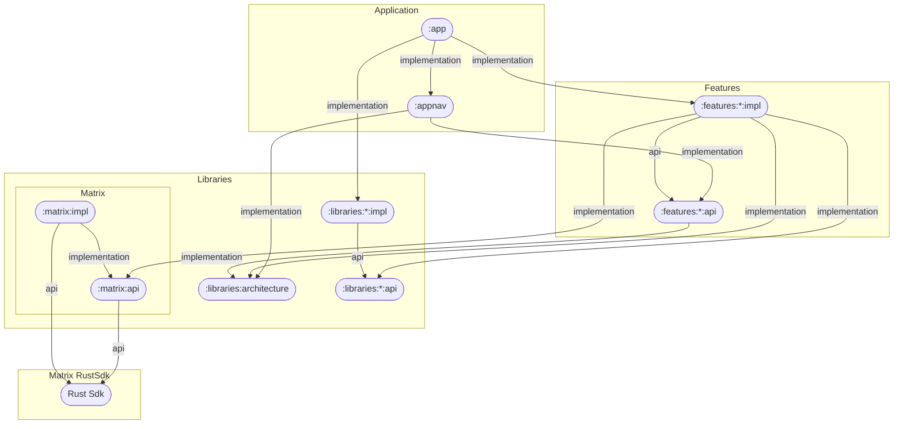

# Developer on boarding

<!--- TOC -->

* [Introduction](#introduction)
  * [Quick introduction to Matrix](#quick-introduction-to-matrix)
    * [Matrix data](#matrix-data)
      * [Room](#room)
      * [Event](#event)
    * [Sync](#sync)
  * [Rust SDK](#rust-sdk)
    * [Matrix Rust Component Kotlin](#matrix-rust-component-kotlin)
    * [Building the SDK locally](#building-the-sdk-locally)
  * [The Android project](#the-android-project)
  * [Application](#application)
    * [Jetpack Compose](#jetpack-compose)
    * [Global architecture](#global-architecture)
    * [Template and naming](#template-and-naming)
  * [Push](#push)
  * [Dependencies management](#dependencies-management)
  * [Test](#test)
  * [Code coverage](#code-coverage)
  * [Other points](#other-points)
    * [Logging](#logging)
    * [Translations](#translations)
    * [Rageshake](#rageshake)
  * [Tips](#tips)
* [Happy coding!](#happy-coding)

<!--- END -->

## Introduction

This doc is a quick introduction about the project and its architecture.

Its aim is to help new developers to understand the overall project and where to start developing.

Other useful documentation:

- all the docs in this folder!
- the [contributing doc](../CONTRIBUTING.md), that you should also read carefully.

### Quick introduction to Matrix

Matrix website: [matrix.org](https://matrix.org), [discover page](https://matrix.org/discover).
*Note*: Matrix.org is also hosting a homeserver ([.well-known file](https://matrix.org/.well-known/matrix/client)).
The reference homeserver (this is how Matrix servers are called) implementation is [Synapse](https://github.com/matrix-org/synapse/). But other implementations
exist. The Matrix specification is here to ensure that any Matrix client, such as Element Android and its SDK can talk to any Matrix server.

Have a quick look to the client-server API documentation: [Client-server documentation](https://spec.matrix.org/v1.3/client-server-api/). Other network API
exist, the list is here: (https://spec.matrix.org/latest/)

Matrix is an open source protocol. Change are possible and are tracked using [this GitHub repository](https://github.com/matrix-org/matrix-doc/). Changes to the
protocol are called MSC: Matrix Spec Change. These are PullRequest to this project.

Matrix object are Json data. Unstable prefixes must be used for Json keys when the MSC is not merged (i.e. accepted).

#### Matrix data

There are many object and data in the Matrix worlds. Let's focus on the most important and used, `Room` and `Event`

##### Room

`Room` is a place which contains ordered `Event`s. They are identified with their `room_id`. Nearly all the data are stored in rooms, and shared using
homeserver to all the Room Member.

*Note*: Spaces are also Rooms with a different `type`.

##### Event

`Events` are items of a Room, where data is embedded.

There are 2 types of Room Event:

- Regular Events: contain useful content for the user (message, image, etc.), but are not necessarily displayed as this in the timeline (reaction, message
  edition, call signaling).
- State Events: contain the state of the Room (name, topic, etc.). They have a non null value for the key `state_key`.

Also all the Room Member details are in State Events: one State Event per member. In this case, the `state_key` is the matrixId (= userId).

Important Fields of an Event:

- `event_id`: unique across the Matrix universe;
- `room_id`: the room the Event belongs to;
- `type`: describe what the Event contain, especially in the `content` section, and how the SDK should handle this Event;
- `content`: dynamic Event data; depends on the `type`.

So we have a triple `event_id`, `type`, `state_key` which uniquely defines an Event.

#### Sync

This is managed by the Rust SDK.

### Rust SDK

The Rust SDK is hosted here: https://github.com/matrix-org/matrix-rust-sdk.

This repository contains an implementation of a Matrix client-server library written in Rust.

With some bindings we can embed this sdk inside other environments, like Swift or Kotlin, with the help of [Uniffi](https://github.com/mozilla/uniffi-rs).
From these kotlin bindings we can generate native libs (.so files) and kotlin classes/interfaces.

#### Matrix Rust Component Kotlin

To use these bindings in an android project, we need to wrap this up into an android library (as the form of an .aar file).
This is the goal of https://github.com/matrix-org/matrix-rust-components-kotlin.
This repository is used for distributing kotlin releases of the Matrix Rust SDK.
It'll provide the corresponding aar and also publish them on maven.

Most of the time **you want to use the releases made on maven with gradle**:

```groovy
implementation("org.matrix.rustcomponents:sdk-android:latest-version")
```

You can also have access to the aars through the [release](https://github.com/matrix-org/matrix-rust-components-kotlin/releases) page.

#### Building the SDK locally

If you want to make changes to the SDK or test them before integrating it with your codebase, you can build the SDK locally too.

Prerequisites:
* Install the Android NDK (Native Development Kit). To do this from within
  Android Studio:
    1. **Tools > SDK Manager**
    2. Click the **SDK Tools** tab.
    3. Select the **NDK (Side by side)** checkbox
    4. Click **OK**.
    5. Click **OK**.
    6. When the installation is complete, click **Finish**.
* Install `cargo-ndk`:
  ```
  cargo install cargo-ndk
  ```
* Install the Android Rust toolchain for your machine's hardware:
  ```
  rustup target add aarch64-linux-android x86_64-linux-android
  ```
* Depending on the location of the Android SDK, you may need to set
  `ANDROID_HOME`:
  ```
  export ANDROID_HOME=$HOME/android/sdk
  ```

You can then build the Rust SDK by running the script
[`tools/sdk/build_rust_sdk.sh`](../tools/sdk/build_rust_sdk.sh) and just answering
the questions.

This will prompt you for the path to the Rust SDK, then build it and
`matrix-rust-components-kotlin`, eventually producing an aar file at
`./libraries/rustsdk/matrix-rust-sdk.aar`, which will be picked up
automatically by the Element X Android build.

Troubleshooting:
 - You may need to set `ANDROID_NDK_HOME` e.g `export ANDROID_NDK_HOME=~/Library/Android/sdk/ndk`.
 - If you get the error `thread 'main' panicked at 'called `Option::unwrap()` on a `None` value', .cargo/registry/src/index.crates.io-6f17d22bba15001f/cargo-ndk-2.11.0/src/cli.rs:345:18` try updating your Cargo NDK version. In this case, 2.11.0 is too old so `cargo install cargo-ndk` to install a newer version.
 - If you get the error `Unsupported class file major version <n>`, try changing your JVM version by setting
   `JAVA_HOME` and, if building via Android Studio, "File | Settings | Build, Execution, Deployment | Build Tools | Gradle | Gradle JDK".

You can switch back to using the published version of the SDK by deleting `libraries/rustsdk/matrix-rust-sdk.aar`.

### The Android project

The project should compile out of the box.

This Android project is a multi modules project.

- `app` module is the Android application module. Other modules are libraries;
- `features` modules contain some UI and can be seen as screen or flow of screens of the application;
- `libraries` modules contain classes that can be useful for other modules to work.

A few details about some modules:

- `libraries-core` module contains utility classes;
- `libraries-designsystem` module contains Composables which can be used across the app (theme, etc.);
- `libraries-elementresources` module contains resource from Element Android (mainly strings);
- `libraries-matrix` module contains wrappers around the Matrix Rust SDK.

Most of the time a feature module should not know anything about other feature module.
The navigation glue is currently done in the `app` module.

Here is the current simplified module dependency graph:

<!-- Note: a full graph can be generated using `./tools/docs/generateModuleGraph.sh`. -->
<!-- Note: doc can be found at https://mermaid.js.org/syntax/flowchart.html#graph -->


### Application

This Android project mainly handle the application layer of the whole software. The communication with the Matrix server, as well as the local storage, the
cryptography (encryption and decryption of Event, key management, etc.) is managed by the Rust SDK.

The application is responsible to store the session credentials though.

#### Jetpack Compose

Compose is essentially two libraries : Compose Compiler and Compose UI. The compiler (and his runtime) is actually not specific to UI at all and offer powerful
state management APIs. See https://jakewharton.com/a-jetpack-compose-by-any-other-name/

Some useful links:

- https://developer.android.com/jetpack/compose/mental-model
- https://developer.android.com/jetpack/compose/libraries
- https://developer.android.com/jetpack/compose/modifiers-list
- https://android.googlesource.com/platform/frameworks/support/+/androidx-main/compose/docs/compose-api-guidelines.md#api-guidelines-for-jetpack-compose

About Preview

- https://alexzh.com/jetpack-compose-preview/

#### Global architecture

Main libraries and frameworks used in this application:

- Navigation state with [Appyx](https://bumble-tech.github.io/appyx/). Please
  watch [this video](https://www.droidcon.com/2022/11/15/model-driven-navigation-with-appyx-from-zero-to-hero/) to learn more about Appyx!
- Dependency injection: [Metro](https://zacsweers.github.io/metro/latest/)
- Reactive State management with Compose runtime and [Molecule](https://github.com/cashapp/molecule)

Some patterns are inspired by [Circuit](https://slackhq.github.io/circuit/)

Here are the main points:

1. `Presenter` and `View` does not communicate with each other directly, but through `State` and `Event`
2. Views are compose first
3. Presenters are also compose first, and have a single `present(): State` method. It's using the power of compose-runtime/compiler.
4. The point of connection between a `View` and a `Presenter` is a `Node`.
5. A `Node` is also responsible for managing DI graph if any, see for instance `LoggedInAppScopeFlowNode`.
6. A `ParentNode` has some children `Node` and only know about them.
7. This is a single activity full compose application. The `MainActivity` is responsible for holding and configuring the `RootNode`.
8. There is no more needs for Android Architecture Component ViewModel as configuration change should be handled by Composable if needed.

#### Template and naming

This documentation provides you with the steps to install and use the AS plugin for generating modules in your project.
The plugin and templates will help you quickly create new features with a standardized structure.

A. Installation

Follow these steps to install and configure the plugin and templates:

1. Install the AS plugin for generating modules :
   [Generate Module from Template](https://plugins.jetbrains.com/plugin/13586-generate-module-from-template)
2. From repository root, run `./tools/templates/generate_templates.sh` to generate the template zip file
3. Import file templates in AS :
   - Navigate to File/Manage IDE Settings/Import Settings
   - Pick the `tmp/file_templates.zip` files
   - Click on OK
4. Configure generate-module-from-template plugin :
   - Navigate to AS/Settings/Tools/Module Template Settings
   - Click on + / Import From File
   - Pick the `tools/templates/FeatureModule.json`

Everything should be ready to use.

B. Usage

Example for a new feature called RoomDetails:

1. Right-click on the features package and click on Create Module from Template
2. Fill the 2 text fields like so:
    - MODULE_NAME = roomdetails
    - FEATURE_NAME = RoomDetails
3. Click on Next
4. Verify that the structure looks ok and click on Finish
5. The modules api/impl should be created under `features/roomdetails` directory.
6. Sync project with Gradle so the modules are recognized (no need to add them to settings.gradle).
7. You can now add more Presentation classes (Events, State, StateProvider, View, Presenter) in the impl module with the `Template Presentation Classes`.
   To use it, just right click on the package where you want to generate classes, and click on `Template Presentation Classes`.
   Fill the text field with the base name of the classes, ie `RootRoomDetails` in the `root` package.


Note that naming of files and classes is important, since those names are used to set up code coverage rules. For instance, presenters MUST have a
suffix `Presenter`,states MUST have a suffix `State`, etc. Also we want to have a common naming along all the modules.

### Push

**Note** Firebase is implemented, but Unified Push is not yet fully implemented on the project, so this is not possible to choose this push provider in the app at the moment.

Please see the dedicated [documentation](notifications.md) for more details.

This is the classical scenario:

- App receives a Push. Note: Push is ignored if app is in foreground;
- App asks the SDK to load Event data (fastlane mode). We have a change to get the data faster and display the notification faster;
- App asks the SDK to perform a sync request.

### Dependencies management

We are using [Gradle version catalog](https://docs.gradle.org/current/userguide/platforms.html#sub:central-declaration-of-dependencies) on this project.

All the dependencies (including android artifact, gradle plugin, etc.) should be declared in [../gradle/libs.versions.toml](libs.versions.toml) file.
Some dependency, mainly because they are not shared can be declared in `build.gradle.kts` files.

[Renovate](https://github.com/apps/renovate) is set up on the project. This tool will automatically create Pull Request to upgrade our dependencies one by one. A [dependency dashboard issue](https://github.com/element-hq/element-x-android/issues/150) is maintained by the tool and allow to perform some actions.

### Test

We have 3 tests frameworks in place, and this should be sufficient to guarantee a good code coverage and limit regressions hopefully:

- Maestro to test the global usage of the application. See the related [documentation](../.maestro/README.md).
- Combination of [Showkase](https://github.com/airbnb/Showkase) and [Paparazzi](https://github.com/cashapp/paparazzi), to test UI pixel perfect. To add test,
  just add `@Preview` for the composable you are adding. See the related [documentation](screenshot_testing.md) and see in the template the
  file [TemplateView.kt](../features/template/src/main/kotlin/io/element/android/features/template/TemplateView.kt). We create PreviewProvider to provide
  different states. See for instance the
  file [TemplateStateProvider.kt](../features/template/src/main/kotlin/io/element/android/features/template/TemplateStateProvider.kt)
- Tests on presenter with [Molecule](https://github.com/cashapp/molecule) and [Turbine](https://github.com/cashapp/turbine). See in the template the class [TemplatePresenterTests](../features/template/src/test/kotlin/io/element/android/features/template/TemplatePresenterTests.kt).

**Note** For now we want to avoid using class mocking (with library such as *mockk*), because this should be not necessary. We prefer to create Fake
implementation of our interfaces. Mocking can be used to mock Android framework classes though, such as `Bitmap` for instance.

### Code coverage

[kover](https://github.com/Kotlin/kotlinx-kover) is used to compute code coverage. Only have unit tests can produce code coverage result. Running Maestro does
not participate to the code coverage results.

Kover configuration is defined in the app [build.gradle.kts](../app/build.gradle.kts) file.

To compute the code coverage, run:

```bash
./gradlew :app:koverHtmlReport
```

and open the Html report: [../app/build/reports/kover/html/index.html](../app/build/reports/kover/html/index.html)

To ensure that the code coverage threshold are OK, you can run

```bash
./gradlew :app:koverVerify
```

Note that the CI performs this check on every pull requests.

Also, if the rule `Global minimum code coverage.` is in error because code coverage is `> maxValue`, `minValue` and `maxValue` can be updated for this rule in
the file [build.gradle.kts](../app/build.gradle.kts) (you will see further instructions there).

### Other points

#### Logging

**Important warning: ** NEVER log private user data, or use the flag `LOG_PRIVATE_DATA`. Be very careful when logging `data class`, all the content will be
output!

[Timber](https://github.com/JakeWharton/timber) is used to log data to logcat. We do not use directly the `Log` class. If possible please use a tag, as per

````kotlin
Timber.tag(loggerTag.value).d("my log")
````

because automatic tag (= class name) will not be available on the release version.

Also generally it is recommended to provide the `Throwable` to the Timber log functions.

Last point, note that `Timber.v` function may have no effect on some devices. Prefer using `Timber.d` and up.


#### Translations

Translations are handled through localazy. See [the dedicated README.md file](../tools/localazy/README.md) for information on how
to configure new modules etc.

#### Rageshake

Rageshake is a feature to send bug report directly from the application. Just shake your phone and you will be prompted to send a bug report.

Bug reports can contain:

- a screenshot of the current application state
- the application logs from up to 15 application starts
- the logcat logs

The data will be sent to an internal server, which is not publicly accessible. A GitHub issue will also be created to a private GitHub repository.

Rageshake can be very useful to get logs from a release version of the application.

### Tips

- Element Android has a `developer mode` in the `Settings/Advanced settings`. Other useful options are available here; (TODO Not supported yet!)
- Show hidden Events can also help to debug feature. When developer mode is enabled, it is possible to view the source (= the Json content) of any Events; (TODO
  Not supported yet!)
- Type `/devtools` in a Room composer to access a developer menu. There are some other entry points. Developer mode has to be enabled; (TODO Not supported yet!)
- Hidden debug menu: when developer mode is enabled and on debug build, there are some extra screens that can be accessible using the green wheel. In those
  screens, it will be possible to toggle some feature flags; (TODO Not supported yet!)
- Using logcat, filtering with `Compositions` can help you to understand what screen are currently displayed on your device. Searching for string displayed on
  the screen can also help to find the running code in the codebase.
- When this is possible, prefer using `sealed interface` instead of `sealed class`;
- When writing temporary code, using the string "DO NOT COMMIT" in a comment can help to avoid committing things by mistake. If committed and pushed, the CI
  will detect this String and will warn the user about it. (TODO Not supported yet!)
- Very occasionally the gradle cache misbehaves and causes problems with code generation. Adding `--no-build-cache` to the `gradlew` command line can help to fix compilation issue.

## Happy coding!

The team is here to support you, feel free to ask anything to other developers.

Also please feel free to update this documentation, if incomplete/wrong/obsolete/etc.

**Thanks!**
